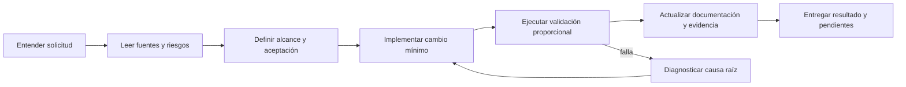

# Manual operativo de DriveMPVD para agentes y desarrolladores

> Este documento define cómo debe trabajar cualquier agente de IA, desarrollador
> u operador. No invente estado, credenciales, resultados de pruebas ni
> configuración. Si un dato no está verificado, indíquelo como **[PENDIENTE]**,
> **[NO VERIFICADO]** o **[REQUIERE AUTORIZACIÓN]**.

## 1. Mandato y orden de autoridad

1. Las instrucciones explícitas y vigentes del propietario prevalecen.
2. Este manual regula el método de trabajo.
3. Los documentos de esta carpeta definen el estado y los procedimientos.
4. El código, las migraciones y la configuración ejecutable prevalecen sobre
   una descripción que haya quedado desactualizada.

Si dos fuentes se contradicen, detenga el cambio de alto impacto, identifique
las rutas en conflicto, revise el comportamiento ejecutable y actualice la
documentación correspondiente. No elija silenciosamente una interpretación.

## 2. Propósito y límites

DriveMPVD es una nube privada personal de un único administrador. Sus
capacidades incluyen autenticación, explorador lógico, creación/renombrado/
movimiento/copia/eliminación, subidas reanudables, descargas con Range,
Favoritos, Recientes, preview seguro y operación con PostgreSQL/Docker/Nginx.

La visión es ofrecer control privado sobre archivos sin sacrificar integridad,
recuperabilidad, trazabilidad ni una experiencia comprensible. El objetivo no
es maximizar funciones: es operar de forma segura y verificable en una VPS. La
base de datos conserva metadatos; el almacenamiento persistente conserva bytes;
ningún cambio puede tratar uno de esos dos planos como accesorio del otro.

No deben agregarse multiusuario, roles, ACL, registro público, invitaciones,
sincronización de escritorio, antivirus, derivados de medios o limpieza de
staging como si ya existieran. Cada una requiere una decisión, diseño,
implementación, pruebas y documentación propios.

## 3. Protocolo de inicio

Antes de editar:

1. Lea [README.md](README.md), este manual, el documento del área y
   [RELEASE.md](RELEASE.md) si afecta entrega u operación.
2. Inspeccione el estado de cambios y preserve modificaciones ajenas.
3. Revise tests, configuración, ADR/decisiones consolidadas y riesgos abiertos.
4. Defina alcance, criterios de aceptación, riesgos y plan de validación.
5. Determine si la acción afecta datos, secretos, una VPS, producción o
   recursos externos.

Para diagnóstico de solo lectura no se necesita una autorización adicional. Para
borrados, despliegues, exposición de puertos, rotación de secretos, cambios de
DNS/TLS, backups o comandos que escriben en una VPS, confirme que existe
autorización explícita y suficiente.

## 4. Ciclo de cambio



Reglas:

- Corrija la causa en la capa correcta; no parche controles HTTP para ocultar
  una invariante de dominio o persistencia.
- No reduzca umbrales, desactive tests ni omita scans para obtener un verde.
- Mantenga cambios pequeños y coherentes; no mezcle refactor masivo, cambio
  funcional y despliegue salvo que se haya pedido explícitamente.
- Actualice tests y documentación dentro de la misma entrega.
- Registre lo que no pudo validar y por qué.

## 5. Límites arquitectónicos obligatorios

La arquitectura es un monolito modular con capas:

```text
infrastructure (composition root)
       |                 |
       v                 v
presentation ------> application ------> domain
       |                 |                  |
       └──────────────> shared <────────────┘
```

| Capa | Debe contener | No puede conocer |
| --- | --- | --- |
| `domain` | Entidades, invariantes, value objects y eventos. | FastAPI, SQLAlchemy, PostgreSQL, JWT, filesystem o HTTP. |
| `application` | Casos de uso, DTOs, puertos y UoW. | `presentation` e `infrastructure`. |
| `infrastructure` | Adaptadores, Settings, ORM y composition root. | No debe filtrar ORM hacia adentro. |
| `presentation` | Rutas, schemas, middleware, OpenAPI y mapping HTTP. | Reglas de negocio, SQLAlchemy o disco directo. |
| `shared` | Tipos transversales mínimos. | Utilidades genéricas que acoplen módulos. |

La inyección por constructor se compone exclusivamente en `infrastructure`.
`presentation` recibe casos de uso ya construidos. Toda configuración procede
del `Settings` central con prefijo `DRIVEMPVD_`; no lea `os.environ` en lógica
de negocio.

## 6. Reglas de seguridad y datos

- Nunca registre ni exponga contraseñas, JWT, CSRF, DSN, claves privadas,
  certificados, nombres completos sensibles de archivo o bytes del usuario.
- Nunca forme una ruta física con entrada del usuario; use IDs/keys opacas y
  `FileStorageProvider`.
- No borre staging, blobs, backups, volúmenes, certificados ni evidencia de
  incidentes manualmente.
- No ejecute `git reset --hard`, `git clean`, `docker compose down --volumes`,
  `alembic downgrade` en producción ni borrados masivos sin alcance y
  autorización explícitos.
- En producción, los secretos viven fuera del checkout, bajo rutas protegidas.
- El código no debe afirmar que un backup es válido hasta que un restore drill
  lo demuestre.

Consulte [SECURITY.md](SECURITY.md), [STORAGE.md](STORAGE.md) y
[BACKUP.md](BACKUP.md).

## 7. Matriz de validación

| Cambio | Verificación mínima |
| --- | --- |
| React/TypeScript | `npm run format`, `lint`, `typecheck`, `test` y `build`. |
| Python | Black, Ruff, MyPy estricto y Pytest. |
| API, DB o migración | Suite PostgreSQL aislada, migración y smoke aplicable. |
| Storage | Tests de streaming, Range, staging/outbox y restore drill según riesgo. |
| Docker/Nginx | Compose config, health, logs, smoke y scans. |
| Seguridad | Tests afectados, source/image scan y revisión de configuración. |
| Release/producción | Checklist completo de [RELEASE.md](RELEASE.md). |

Una prueba unitaria, build o healthcheck aprobados nunca sustituyen la
validación de integración, seguridad, UX, recuperación o carga requerida.

## 8. Documentación obligatoria

| Cambio | Actualización requerida |
| --- | --- |
| Entorno local, convenciones o código | [DEVELOPMENT.md](DEVELOPMENT.md). |
| Arquitectura o límites | [ARCHITECTURE.md](ARCHITECTURE.md); una decisión nueva se resume allí. |
| API | [API.md](API.md), OpenAPI y pruebas. |
| Datos o migración | [DATABASE.md](DATABASE.md), pruebas y changelog. |
| Transferencia o bytes | [STORAGE.md](STORAGE.md) y pruebas. |
| Seguridad | [SECURITY.md](SECURITY.md) y riesgos. |
| Tests | [TESTING.md](TESTING.md) si cambian puerta, cobertura o evidencia. |
| Operación/despliegue | [DEPLOYMENT.md](DEPLOYMENT.md), [VPS.md](VPS.md), [DOCKER.md](DOCKER.md) o [NGINX.md](NGINX.md). |
| Backups, restauración o rollback | [BACKUP.md](BACKUP.md) y [OPERATIONS.md](OPERATIONS.md). |
| Diagnóstico o incidente | [TROUBLESHOOTING.md](TROUBLESHOOTING.md) y [OPERATIONS.md](OPERATIONS.md). |
| Release/riesgo | [RELEASE.md](RELEASE.md), [CHANGELOG.md](CHANGELOG.md) y el registro de pendientes correspondiente. |

No duplique la misma explicación en varios documentos: enlace a la fuente
temática. Mantenga los ejemplos libres de secretos.

## 9. Git, sincronización y releases

Un release público requiere Git local operativo, remoto autorizado, tag
inmutable, SHA/manifest, checkout limpio y comparación certificada
Local–Git–VPS. En el estado histórico consolidado estas condiciones no estaban
completas; revíselas antes de asumirlas.

- Git es la vía soportada para una publicación pública.
- `rsync`, SCP y SFTP solo pueden depositar un artefacto verificable, nunca
  sobrescribir el checkout activo o desplegar implícitamente.
- FTP está prohibido.
- Compare hashes por ruta con las mismas exclusiones para dependencias, caches,
  secrets, certificados y runtime data.

El detalle y checklists están en [RELEASE.md](RELEASE.md).

## 10. Acciones que exigen detenerse

Pida dirección antes de continuar cuando falte:

- definición funcional que cambie datos, UX o seguridad;
- credencial, clave, dominio, cuenta cloud o autorización de producción;
- política de RPO/RTO, retención, backup offsite o respuesta a incidentes;
- alcance de una limpieza o borrado;
- plan de compatibilidad para migración destructiva;
- evidencia suficiente para resolver una contradicción documental.

## 11. Definición de terminado

Una tarea termina únicamente si:

- cumple criterios de aceptación;
- conserva arquitectura y seguridad;
- pasa las pruebas/gates aplicables;
- actualiza documentación y changelog;
- no deja secretos, artefactos o cambios no relacionados;
- comunica evidencia, límites y pendientes.

Un proyecto no está listo para producción pública porque compila. Debe superar
todos los gates de [RELEASE.md](RELEASE.md), incluidos trazabilidad, DNS/TLS,
seguridad, restore, rendimiento, UX e incidentes.

## 12. Método de análisis y planificación

Antes de proponer una modificación, forme una línea base reproducible:

1. localice los puntos de entrada, configuración, tests, migraciones y scripts
   que correspondan al alcance;
2. lea código ejecutable y contratos antes que comentarios o resultados
   históricos;
3. diferencie **hechos verificados**, **hipótesis**, **limitaciones conocidas**
   y **decisiones que requieren autorización**;
4. trace el flujo completo cuando cruza navegador, API, base, storage y worker;
5. defina qué evidencia podría refutar la hipótesis y qué validación demostrará
   el resultado.

Un análisis debe responder: qué ocurre, dónde se origina, qué datos o contratos
afecta, cuál es el riesgo de reversión y cómo se comprobará la corrección. No
convierta un síntoma en una conclusión ni cambie varias capas a ciegas.

Para una funcionalidad nueva, declare el contrato de usuario, API, datos,
storage, seguridad, observabilidad, migración, compatibilidad, pruebas y
rollback antes de implementarla. Si alguno no aplica, indique por qué.

## 13. Topología del repositorio y convenciones

| Ruta | Propietario y regla principal |
| --- | --- |
| `backend/app/domain` | Modelo de negocio puro e invariantes. |
| `backend/app/application` | Casos de uso, DTOs, puertos y UoW. |
| `backend/app/infrastructure` | Adaptadores de persistencia, filesystem, settings y composición. |
| `backend/app/presentation` | FastAPI, schemas, middleware y delivery HTTP. |
| `backend/alembic` | Historia de esquema inmutable una vez aplicada. |
| `frontend/src/app` | Bootstrap, router, providers y shell. |
| `frontend/src/features` | Funcionalidad organizada por dominio de UI. |
| `frontend/src/shared` | API cliente, configuración y UI transversal mínima. |
| `docker` y `compose.yaml` | Imágenes, edge, operación verificable y entornos de ejemplo. |
| `scripts` | Automatización reproducible; no secretos ni cambios implícitos de producción. |
| `docs` | Única documentación permanente por tema. |

- Python: módulos/funciones/variables en `snake_case`, clases y tipos en
  `PascalCase`, constantes en `UPPER_SNAKE_CASE`; type hints públicos son
  obligatorios.
- TypeScript/React: archivos y funciones siguen la convención ya dominante de
  su feature; componentes y tipos en `PascalCase`, hooks con prefijo `use`,
  valores en `camelCase`. No mezcle estilos dentro del mismo módulo.
- API: nombres, errores, headers, cursor y envelope son contrato. No cambie
  semántica HTTP para acomodar una sola pantalla.
- Base de datos: una migración describe cada cambio de esquema; no haga DDL
  manual en un entorno persistente.
- Configuración: añada settings centralizados y plantillas sin secretos; no
  distribuya literales de producción por código, scripts o documentación.

Antes de crear una carpeta, capa, abstracción o script, busque una ubicación
existente que posea esa responsabilidad. La conveniencia local no justifica
duplicar un proveedor, cliente HTTP, modelo de configuración o runbook.

## 14. Diagnóstico, corrección y auditoría

### Diagnóstico de fallos

1. reproduzca de forma mínima y guarde entrada, entorno, hora y resultado;
2. inspeccione logs sanitizados, respuesta HTTP, trazas, métricas y estado de
   datos sin revelar secretos ni nombres sensibles;
3. reduzca el problema a una capa y contraste contrato esperado contra real;
4. escriba o ajuste una prueba que falle por la causa, cuando sea viable;
5. corrija la causa raíz, valide regresión y documente el comportamiento.

Si no se puede reproducir, no simule certeza. Registre el rango de versiones,
datos faltantes, impacto observado y el siguiente experimento seguro.

### Auditoría y limpieza

Para identificar código muerto, documentación obsoleta o recursos candidatos a
eliminación, primero inventarie, lea y clasifique: fuente de verdad, duplicado,
histórico, generado, pendiente o huérfano. Antes de borrar, busque referencias
en frontend, backend, tests, migraciones, Compose, Nginx, CI, scripts y la
documentación oficial. Consolide primero cualquier información única.

No eliminar sin evidencia: migraciones aplicadas, datos de usuario, storage,
backups, secretos, certificados, archivos de runtime, logs de incidente,
dependencias activas ni scripts utilizados por una vía de release. Un elemento
generado también se conserva si interviene en la validación presente. Todo
borrado debe quedar en un informe con objetivo, evidencia, impacto y rollback
posible.

## 15. Validación, lectura de resultados y calidad

Use la matriz de la sección 7 como mínimo y añada controles por riesgo. La
interpretación es tan importante como ejecutar un comando:

| Resultado | Interpretación obligatoria |
| --- | --- |
| Test o build verde | Evidencia limitada al contrato ejercitado; no certifica producción. |
| Test rojo | Clasificar como regresión, flake, entorno, contrato esperado o defecto; no ocultarlo con reintento. |
| Scan con hallazgo | Evaluar severidad, explotabilidad, alcance, compensación, fecha y responsable. |
| Benchmark | Registrar dataset, host, límites, concurrencia, versión y percentiles; sin esos datos no hay conclusión. |
| Smoke/health verde | El proceso está vivo; completar auth, mutaciones, bytes, logs y restore según alcance. |

Validaciones por plano:

- Frontend: formato, lint, tipos, pruebas, build y revisión de estados de UX,
  foco, responsive, accesibilidad y errores recuperables.
- Backend: estilo, lint, tipos, unitarias/integración, OpenAPI y traducción
  segura de errores.
- PostgreSQL/migraciones: suite aislada, upgrade, constraints, consultas
  críticas, backup/restauración cuando cambie persistencia.
- Storage: límites de memoria, checksum, staging, publicación, `HEAD`, Range,
  permisos, ausencia de traversal y reconciliación DB–filesystem.
- Docker/Nginx/VPS: config, healthchecks, logs, redes, límites, headers,
  cookies, TLS y exposición autorizada.
- Seguridad/rendimiento: controles específicos con evidencia fechada; no
  extrapolar resultados de una máquina o dataset pequeño.

Los detalles de comandos y criterios pertenecen a [TESTING.md](TESTING.md),
[DATABASE.md](DATABASE.md), [STORAGE.md](STORAGE.md), [DOCKER.md](DOCKER.md),
[NGINX.md](NGINX.md) y [SECURITY.md](SECURITY.md).

## 16. Informes, scripts y entrega

Cada cambio relevante deja una nota de entrega que incluya alcance, rutas
modificadas, validaciones ejecutadas con resultado, evidencia o comandos
reproducibles, riesgos, rollback y pendientes. Actualice
[CHANGELOG.md](CHANGELOG.md) para hitos o cambios visibles; no lo use para
copiar logs completos.

Al crear un script:

1. defina propósito, entradas, salidas, precondiciones y modo de fallo;
2. use `set -euo pipefail` en shell cuando sea compatible y valide argumentos;
3. no imprima secretos ni acepte valores sensibles como argumentos si existe
   una vía de archivo protegido;
4. haga explícitos los efectos de escritura y ofrezca preflight o dry-run si
   el riesgo lo exige;
5. añada prueba o validación de sintaxis y documente dueño/uso en el documento
   temático.

Los informes de auditoría son artefactos puntuales y no sustituyen la fuente
temática de `docs/`. Si sus conclusiones siguen vigentes, intégralas antes de
archivarlos o retirarlos.

## 17. Operación, recuperación e incidentes

En un incidente, preservar evidencia y contener el impacto tienen prioridad
sobre una corrección apresurada. Declare severidad e impacto, conserve la hora
en UTC, recoja logs sanitizados, aplique solo mitigaciones autorizadas y
verifique recuperación funcional. No rota secretos, restaura datos, cambia
firewall, expone puertos ni ejecuta rollback de producción sin la autorización
correspondiente.

Un backup no está validado hasta restaurarlo en un entorno desechable y
comprobar base, blobs y flujos críticos. Un rollback no equivale a `alembic
downgrade`: use una release conocida, compatible con la migración aplicada y
un plan explícito de datos. Siga [BACKUP.md](BACKUP.md),
[OPERATIONS.md](OPERATIONS.md), [TROUBLESHOOTING.md](TROUBLESHOOTING.md) y
[DEPLOYMENT.md](DEPLOYMENT.md).

## 18. Definición estricta de listo para producción

El sistema solo puede declararse listo para producción pública cuando exista
evidencia fechada y revisable de **todos** los grupos siguientes:

- release trazable: remoto Git autorizado, commit/tag inmutable, manifest y
  comparación Local–Git–VPS aprobada;
- calidad: suites, tipos, lint, build, contratos y gates de CI aplicables en
  verde, sin exclusiones silenciosas;
- seguridad: secretos fuera del checkout, auth/CSRF/cookies/headers verificados,
  scans evaluados, firewall, DNS, TLS/HSTS y exposición aprobados;
- datos y storage: migraciones, invariantes, checksums y reconciliación
  PostgreSQL–filesystem comprobados, además de restore drill exitoso;
- continuidad: backup cifrado/offsite, retención, RPO/RTO, monitoreo, alertas,
  runbooks e incident response aprobados;
- capacidad y UX: pruebas con tamaño/concurrencia/red representativos, revisión
  browser/E2E y accesibilidad/responsive de los flujos críticos;
- operación: health, logs, métricas, rollback probado y responsable de release
  identificado.

Una casilla **[PENDIENTE]**, evidencia vencida o resultado no reproducible
bloquea esa declaración. El estado histórico de DriveMPVD es una candidata
privada; no debe reinterpretarse como certificación pública hasta completar el
checklist de [RELEASE.md](RELEASE.md).
